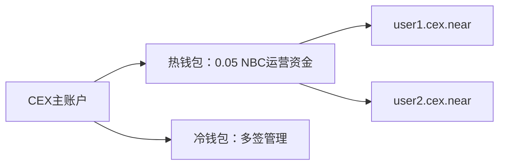

# NBC 对接中心化交易所（CEX）接口文档

以下为 CEX 对接 nbc 钱包的关键接口、使用方式与实现要点，适用于充值、提现、监控与风控处理。

---

##  一、核心接口清单与使用方式

| 功能分类     | 接口/方法                     | 参数示例                                                                 | 使用场景                        | 实现要点                                                     |
|--------------|------------------------------|--------------------------------------------------------------------------|-------------------------------|--------------------------------------------------------------|
| **账户管理** |                              |                                                                          |                               |                                                              |
| `create_account` | 创建子账户               | `{ "new_account_id": "user123.cex.near", "public_key": "ed25519:..." }` | 为用户生成唯一存款地址         | 主账户发起，需预存 0.0012 NBC 押金                          |
| `view_account`   | 查询账户状态             | `{ "account_id": "user123.cex.near" }`                                   | 验证账户是否存在、查询余额     | 返回 `amount`, `storage_usage`                              |
| `add_key`        | 添加多签密钥             | `{ "public_key": "ed25519:...", "access_key": { "permission": "FullAccess" }}` | 设置冷钱包审批权限       | 限定权限或用途                                               |
| **资产操作** |                              |                                                                          |                               |                                                              |
| `send_money`     | NBC 转账                | `{ "receiver_id": "cex.near", "amount": "1000000000000000000000000" }`   | 用户提现                      | 注意 Gas 成本和失败回滚                                      |
| `ft_transfer`    | FT 代币转账（NEP-141）   | `{ "receiver_id": "userx.near", "amount": "1000000", "memo": "withdraw" }` | 处理 USDT、ETH 等代币提现 | 先调用 `storage_deposit` 为接收方充值押金                    |
| `batch_actions`  | 批量操作                 | 多笔 `ft_transfer` 或 `send_money` 组合                                  | 节省 Gas 处理批量提现         | 限 100 Action、Gas 不超 300 TGas                            |
| **交易处理** |                              |                                                                          |                               |                                                              |
| `tx`             | 查询交易状态             | `{ "tx_hash": "9avx...", "sender_id": "user123.near" }`                  | 充值到账确认                  | 解析 `SuccessValue` 或处理 `Failure`                        |
| `EXPERIMENTAL_changes` | 链上事件监听       | `{ "block_id": 12345678, "changes_type": "data_changes", "key_prefix": "receipt" }` | 捕获代币转账事件         | 解析日志 `event:ft_transfer`                                |
| `block`          | 获取区块数据             | `{ "block_id": 12345678 }`                                               | 获取区块、交易列表            | 配合 `chunk` 获取完整数据                                    |
| **安全风控** |                              |                                                                          |                               |                                                              |
| `add_request`     | 多签提现发起请求        | `{ "request": { "receiver_id": "userx.near", "actions": [{ "Transfer": {...} }] } }` | 大额提现申请流程          | 热钱包发起，冷钱包审批 `confirm`                             |
| `EXPERIMENTAL_tx_status` | 交易模拟         | 原始交易 JSON                                                             | 预估交易成功与否              | 检查 Gas 与存储是否足够                                      |

---

##  二、对接实施方案

### 1. 账户体系设计

- 用户子账户统一命名格式 `<user_id>.cex.near`
- 热钱包用于日常充值提现操作
- 冷钱包用于资产存储与审批操作

---

### 2. 提现安全方案

- 小额提现：热钱包直接调用 `send_money` 或 `ft_transfer`
- 大额提现流程：
  1. 热钱包调用多签合约 `add_request`
  2. 冷钱包离线签名执行 `confirm`
  3. 广播交易执行转账

---

##  三、必备条件与合规要点

### 1. 技术依赖

- **SDK：**
  - JS: [near-api-js](https://github.com/near/near-api-js)
  - Python: [near-py](https://github.com/near/near-py)
- **节点服务：**
  - 公共 RPC：`206.238.196.207:3030` / `https://near.lava.build`
  
- **数据索引器：**
  - 使用 NEAR Indexer 自建监听服务，替代频繁 RPC 轮询

---

### 2. 合规与风控

- **存储押金：**
  - 每用户预留 0.0012 nbc
  - 释放空账户以回收存储费用
- **AML 风控：**
  - 接入 Chainalysis 或 TRM Labs 查询地址风险
  - 所有转账 `memo` 字段附带用户 ID 用于审计
- **Gas 费用控制：**
  - 推荐费用公式：0.0001 nbc + 按字节费
  - 主网上限：300 TGas 每交易

---

##  四、推荐工具与测试流程

### 1. 工具推荐

| 类型       | 工具链接                                                                 | 用途               |
|------------|--------------------------------------------------------------------------|--------------------|
| SDK        | [near-api-js](https://github.com/near/near-api-js)                      | 开发集成           |
| 测试网     | [Testnet Faucet](https://testnet.mynearwallet.com/)                     | 申请测试 NEAR      |
| 监控平台   | [Pagoda Console](https://console.pagoda.co/)                            | 节点与链监控       |

---

### 2. 测试流程

1. **部署环境：**
   - 测试 RPC：`https://test.rpc.fastnear.com`
   - 账户前缀：如 `cex.testnet`

2. **模拟场景：**
   - 用户向 `user123.cex.testnet` 充值 USDT
   - 热钱包调用 `ft_transfer` 发起提现

3. **压力测试：**
   - 构造 `batch_actions` 并发执行 100 笔交易
   - 监控 RPC 响应时间与 Gas 消耗

---

## 总结

- **账户结构安全隔离**：主账户、热钱包、子账户分层管理
- **事件驱动交易监控**：通过链上 `ft_transfer` 事件监听充值
- **大额交易冷钱包审批**：热钱包发起，冷钱包审批
- **押金与 Gas 成本控制**：动态管理用户账户的存储费用

---

📚 **参考资料**：

- [NEAR RPC 文档](https://docs.near.org/api/rpc)
- [NEP-141 Fungible Token 标准](https://nomicon.io/Standards/FungibleToken/Core)
- [NEAR Core GitHub](https://github.com/near/nearcore)
